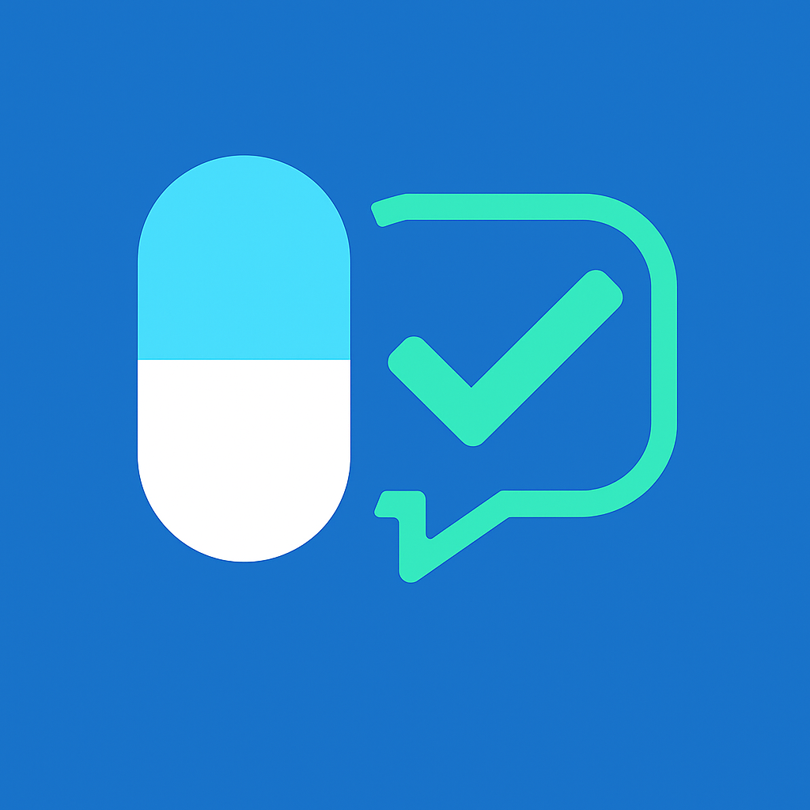
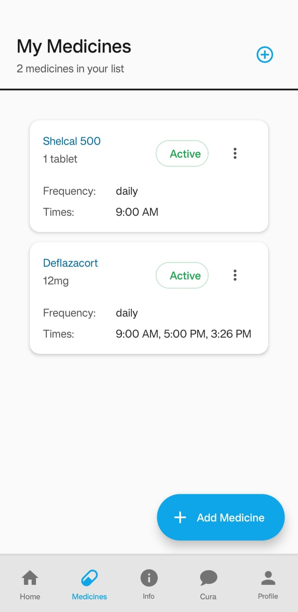
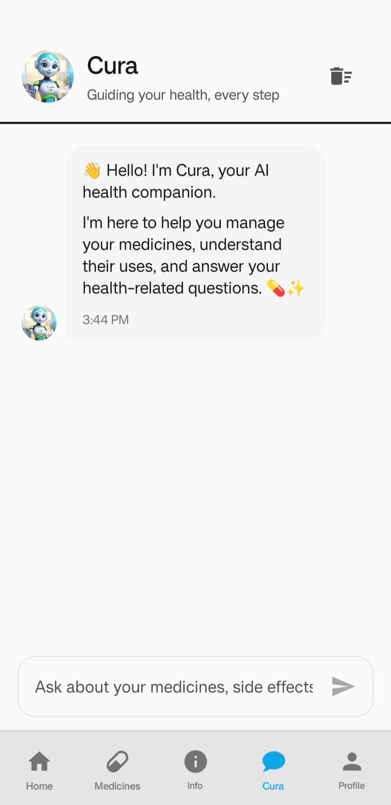
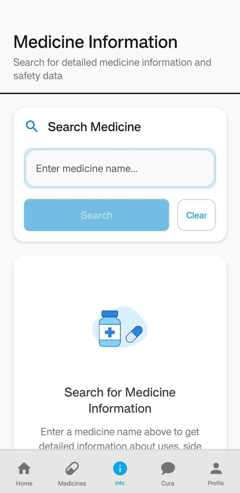

<div align="center">
  <table>
    <tr>
      <td></td>
      <td><h1 style="font-size: 40px;">MediMind AI</h1></td>
    </tr>
  </table>
  <p><em>AI-powered Medicine Reminder & Information App</em></p>
</div>


<div align="center">


**AI-powered Medicine Reminder & Information App**

[](https://expo.dev/)
[](https://reactnative.dev/)
[](https://www.typescriptlang.org/)
[](https://supabase.com/)

*Guiding your health, every step*

[Features](#-features) • [Download](#-download) • [Installation](#-installation) • [Usage](#-usage) • [Screenshots](#-screenshots) • [Tech Stack](#-tech-stack) • [Contributing](#-contributing)

</div>

---

## 📱 About MediMind AI

MediMind AI is a comprehensive mobile application designed to help users manage their medication schedules effectively while providing AI-powered information about medicines. The app combines intelligent reminder systems with an AI chatbot to answer medical queries, making medication management safer and more informed.

### 🎯 Key Features

- **🤖 AI-Powered Medicine Information**: Get detailed information about medicines including uses, side effects, and interactions
- **⏰ Smart Reminder System**: Never miss a dose with intelligent notifications and daily checklists
- **💬 AI Chatbot**: Ask questions about medicines and get instant, reliable answers
- **📊 Medicine Tracking**: Track your medication history and adherence
- **🔔 Customizable Notifications**: Set up personalized reminder schedules
- **📱 Android App**: Optimized for Android devices

## ✨ Features

### 🏠 Dashboard
- **Daily Medicine Checklist**: View all medicines scheduled for the day
- **Quick Actions**: Mark medicines as taken, skipped, or missed
- **Health Tips**: Daily health tips and wellness advice
- **Progress Tracking**: Visual indicators of medication adherence

### 💊 Medicine Management
- **Add Medicines**: Simple form to add new medicines with dosage and timing
- **Edit & Delete**: Modify medicine details or remove from schedule
- **Notes**: Add personal notes for each medicine

### 🤖 AI Medicine Information
- **Medicine Search**: Search for any medicine to get detailed information
- **Uses & Side Effects**: Comprehensive information about medicine purposes and potential side effects
- **Interactions**: Check for potential drug interactions
- **Dosage Information**: Get recommended dosage guidelines

### 💬 AI Chatbot
- **Natural Language Queries**: Ask questions in plain English
- **Medical Advice**: Get answers about medicine compatibility, side effects, and usage
- **Conversation History**: Review previous conversations
- **Reliable Information**: Powered by advanced AI models

### 🔔 Smart Notifications
- **Customizable Timing**: Set specific times for each medicine
- **Repeat Schedules**: Configure daily, weekly, or custom repeat patterns
- **Snooze Options**: Snooze notifications when needed
- **Missed Dose Alerts**: Get notified about missed doses


## 📸 Screenshots

<div align="center">

### Home Dashboard


### Medicine Management


### AI Chatbot


### Medicine Information


### Profile & Settings


</div>

*Note: Screenshots will be added once the app is fully developed and tested*

## 📱 Download

<div align="center">

### Get MediMind AI on Your Device

[](https://www.mediafire.com/file/sutieqbvsi6uvk0/application-dca04daa-a0a2-42b8-acc2-b39153284ca7.apk/file)

### 📱 How to Install

1. **Download APK** from the link above
2. **Enable "Install from Unknown Sources"** in your device settings
3. **Install the APK** and start using MediMind AI

</div>

### 🔗 Download Links

- **[📱 APK Download](https://www.mediafire.com/file/sutieqbvsi6uvk0/application-dca04daa-a0a2-42b8-acc2-b39153284ca7.apk/file)** - Direct APK download for Android

### 📋 System Requirements

- **Android**: Android 8.0 (API level 26) or later

## 🚀 Installation

### Prerequisites

- [Node.js](https://nodejs.org/) (v18 or higher)
- [Expo CLI](https://docs.expo.dev/get-started/installation/)
- [Git](https://git-scm.com/)

### Quick Start

1. **Clone the repository**
   ```bash
   git clone https://github.com/Sravan466/medimind-ai.git
   cd medimind-ai
   ```

2. **Install dependencies**
   ```bash
   npm install
   ```

3. **Set up environment variables**
   ```bash
   cp config.example.env .env
   ```
   
   Edit `.env` and add your configuration:
   ```env
   EXPO_PUBLIC_SUPABASE_URL=your_supabase_url
   EXPO_PUBLIC_SUPABASE_ANON_KEY=your_supabase_anon_key
   EXPO_PUBLIC_AI_API_KEY=your_ai_api_key
   ```

4. **Start the development server**
   ```bash
   npm start
   ```

5. **Run on your device**
   - Install the Expo Go app on your phone
   - Scan the QR code from the terminal
   - Or press `a` for Android emulator

### Building for Production

#### Android
```bash
npx eas build --platform android
```

#### Web
```bash
npm run deploy
```

## 📱 Usage

### Getting Started

1. **Create Account**: Sign up with your email and create a profile
2. **Add Medicines**: Use the "Add Medicine" button to add your medications
3. **Set Reminders**: Configure notification times for each medicine
4. **Get Information**: Search for medicines to get AI-powered information
5. **Ask Questions**: Use the chatbot for medical queries

### Adding a Medicine

1. Tap the "Add Medicine" button on the home screen
2. Enter the medicine name
3. Set the dosage and frequency
4. Choose notification times
5. Add any notes or images
6. Save to schedule reminders

### Using the AI Chatbot

1. Navigate to the Chat tab
2. Type your question (e.g., "Can I take paracetamol with ibuprofen?")
3. Get instant, reliable answers from the AI

### Medicine Information Search

1. Go to the Info tab
2. Search for any medicine name
3. View detailed information including:
   - Uses and indications
   - Side effects
   - Dosage guidelines
   - Drug interactions


## 🛠️ Tech Stack

### Frontend
- **[React Native](https://reactnative.dev/)** - Cross-platform mobile development
- **[Expo](https://expo.dev/)** - Development platform and tools
- **[TypeScript](https://www.typescriptlang.org/)** - Type safety and better development experience
- **[React Native Paper](https://callstack.github.io/react-native-paper/)** - Material Design components
- **[Expo Router](https://docs.expo.dev/router/introduction/)** - File-based navigation

### Backend & Database
- **[Supabase](https://supabase.com/)** - Backend-as-a-Service with PostgreSQL database
- **[Supabase Auth](https://supabase.com/docs/guides/auth)** - User authentication
- **[Row Level Security (RLS)](https://supabase.com/docs/guides/auth/row-level-security)** - Data security

### AI & External Services
- **[DeepSeek API](https://platform.deepseek.com/)** - AI-powered medicine information and chatbot
- **[Expo Notifications](https://docs.expo.dev/versions/latest/sdk/notifications/)** - Push notifications

### Development Tools
- **[Expo CLI](https://docs.expo.dev/workflow/expo-cli/)** - Development and building tools
- **[EAS Build](https://docs.expo.dev/build/introduction/)** - Cloud build service
- **[Metro](https://metro.dev/)** - JavaScript bundler

## 📁 Project Structure

```
MediMindAI/
├── app/                          # Expo Router app directory
│   ├── (auth)/                   # Authentication screens
│   ├── (tabs)/                   # Main app tabs
│   └── _layout.tsx               # Root layout
├── src/
│   ├── components/               # Reusable components
│   ├── contexts/                 # React contexts
│   ├── hooks/                    # Custom React hooks
│   ├── services/                 # API and external services
│   ├── types/                    # TypeScript definitions
│   ├── utils/                    # Utility functions
│   └── styles/                   # Global styles
├── assets/                       # Static assets
├── docs/                         # Documentation
└── logs/                         # Development logs
```

## 🔧 Configuration

### Environment Variables

Create a `.env` file in the root directory:

```env
# Supabase Configuration
EXPO_PUBLIC_SUPABASE_URL=your_supabase_project_url
EXPO_PUBLIC_SUPABASE_ANON_KEY=your_supabase_anon_key

# AI API Configuration
EXPO_PUBLIC_AI_API_KEY=your_deepseek_api_key
EXPO_PUBLIC_AI_BASE_URL=https://api.deepseek.com

# App Configuration
EXPO_PUBLIC_APP_NAME=MediMind AI
EXPO_PUBLIC_APP_VERSION=1.0.0
```

### Supabase Setup

1. Create a new Supabase project
2. Run the database migrations from `database_setup.sql`
3. Configure Row Level Security policies
4. Set up authentication providers

## 🚀 Deployment

### Using EAS Build

1. **Install EAS CLI**
   ```bash
   npm install -g @expo/eas-cli
   ```

2. **Login to Expo**
   ```bash
   eas login
   ```

3. **Configure EAS**
   ```bash
   eas build:configure
   ```

4. **Build for platforms**
   ```bash
   # Android
   eas build --platform android
   
   # iOS
   eas build --platform ios
   
   # Both
   eas build --platform all
   ```

### Web Deployment

```bash
npm run deploy
```

## 🤝 Contributing

We welcome contributions! Please follow these steps:

1. **Fork the repository**
2. **Create a feature branch**
   ```bash
   git checkout -b feature/amazing-feature
   ```
3. **Make your changes**
4. **Add tests** (if applicable)
5. **Commit your changes**
   ```bash
   git commit -m 'Add amazing feature'
   ```
6. **Push to the branch**
   ```bash
   git push origin feature/amazing-feature
   ```
7. **Open a Pull Request**

### Development Guidelines

- Follow TypeScript best practices
- Use React Native Paper components for UI consistency
- Write meaningful commit messages
- Add comments for complex logic
- Test on both iOS and Android

## 📄 License

This project is licensed under the MIT License - see the [LICENSE](LICENSE) file for details.

## 🙏 Acknowledgments

- [Expo](https://expo.dev/) for the amazing development platform
- [Supabase](https://supabase.com/) for the backend infrastructure
- [React Native Paper](https://callstack.github.io/react-native-paper/) for the UI components
- [DeepSeek](https://platform.deepseek.com/) for AI capabilities

## 📞 Support

- **Email**: support@medimind.ai
- **Issues**: [GitHub Issues](https://github.com/Sravan466/medimind-ai/issues)
- **Documentation**: [Wiki](https://github.com/Sravan466/medimind-ai/wiki)

## 🔮 Roadmap

### Version 1.1
- [ ] Offline support
- [ ] Medicine interaction checker
- [ ] Export medication history
- [ ] Family member management

### Version 1.2
- [ ] Voice reminders
- [ ] Medicine barcode scanning
- [ ] Integration with health apps
- [ ] Advanced analytics

### Version 2.0
- [ ] Telemedicine integration
- [ ] Prescription management
- [ ] Insurance integration
- [ ] Multi-language support

---

<div align="center">

**Made with ❤️ for better health management**

[](https://github.com/Sravan466/medimind-ai)

</div>
