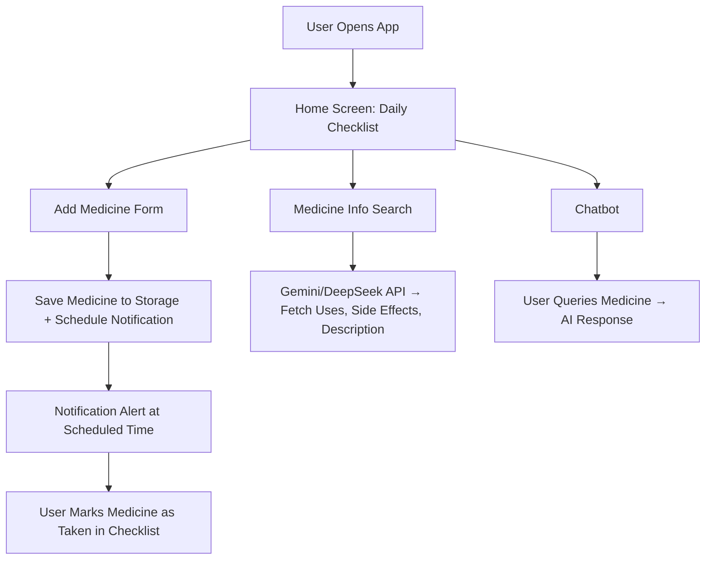

# 📱 MediMind AI – AI-powered Medicine Reminder & Info App

## 🚀 Overview

MediMind is a simple productivity app designed to help users stay consistent with their daily medication routine. It combines:

- ✅ **Medicine Reminder System** (with notifications & daily checklist)
- 🤖 **AI-powered Medicine Information System** (using Gemini/DeepSeek API)
- 💬 **Integrated Chatbot** to answer user queries about medicines

## 🎯 Core Problem

People often forget to take medicines on time and lack quick access to trustworthy medicine information.

## ✨ MVP (Minimum Viable Product)

### Medicine Reminders
- Add medicine name + time
- Show daily checklist
- Use browser/app notifications

### AI Medicine Information
When user enters a medicine/tablet name, AI searches for:
- ✅ **Uses**
- ⚠️ **Side effects**
- 📖 **Description**

### Chatbot Integration
Users can ask free-form questions like:
- "What is Paracetamol used for?"
- "Does this medicine have drowsiness as a side effect?"

## 📂 App Flow & Features

### 1. Home Screen (Dashboard)

**Today's Medicines Checklist**
- List of medicines scheduled for the day
- Checkbox to mark as "Taken"
- Missed medicines shown in red

**Add Medicine Button**
- Opens a simple form to add medicine

### 2. Add Medicine Form

**Fields:**
- Medicine Name (text input)
- Time (time picker)
- (Optional) Repeat Days (checkboxes: Mon–Sun)
- (Optional) Snooze duration

**Actions:**
- Save medicine to localStorage / DB
- Schedule notification

### 3. Notifications

- Use Notification API (for browser MVP)
- Later upgrade with Push Notifications for mobile

**Example alert:**
```
"Time to take: Paracetamol 500mg"
```

### 4. AI Medicine Info (via Gemini/DeepSeek API)

**Flow:**
1. User types a medicine name
2. API request → fetch AI-generated structured response

**Example Response:**
```json
{
  "medicine": "Paracetamol",
  "uses": "Reduces fever and relieves mild to moderate pain.",
  "side_effects": "Nausea, rash, liver damage if overdosed.",
  "description": "Paracetamol is a widely used over-the-counter analgesic and antipyretic."
}
```

Display results in a card layout under Medicine Info tab

### 5. Chatbot (AI Q&A Assistant)

- Accessible via a Chat screen
- User types queries like:
  - "Can I take Paracetamol with Ibuprofen?"
  - "What is the dosage for Amoxicillin 500mg?"
- AI responds conversationally using Gemini/DeepSeek API

## 🛠️ Tech Stack

### Frontend
- **React Native** with **TypeScript**
- **Expo** for cross-platform development
- **Expo Router** for navigation

### Backend/Database
- **Supabase** for backend services and database

### UI Framework
- **React Native Paper** for Material Design components

### AI Processing
- **DeepSeek** or **Gemini** API for medicine information and chatbot

### Notifications
- **Expo Notifications** for push notifications
- **Local Notifications** for in-app alerts

### Development Tools
- **Expo CLI** for development and building
- **TypeScript** for type safety
- **React Native Paper** components for UI consistency

## 🗄️ Database Schema (Supabase)

### Tables

#### 1. `users` Table
```sql
CREATE TABLE users (
  id UUID PRIMARY KEY DEFAULT gen_random_uuid(),
  email VARCHAR(255) UNIQUE NOT NULL,
  full_name VARCHAR(255),
  phone_number VARCHAR(20),
  date_of_birth DATE,
  emergency_contact VARCHAR(255),
  emergency_phone VARCHAR(20),
  created_at TIMESTAMP WITH TIME ZONE DEFAULT NOW(),
  updated_at TIMESTAMP WITH TIME ZONE DEFAULT NOW()
);
```

#### 2. `medicines` Table
```sql
CREATE TABLE medicines (
  id UUID PRIMARY KEY DEFAULT gen_random_uuid(),
  user_id UUID REFERENCES users(id) ON DELETE CASCADE,
  name VARCHAR(255) NOT NULL,
  dosage VARCHAR(100),
  frequency VARCHAR(100),
  time_schedule TIME[],
  repeat_days INTEGER[], -- 0=Sunday, 1=Monday, etc.
  start_date DATE NOT NULL,
  end_date DATE,
  is_active BOOLEAN DEFAULT true,
  notes TEXT,
  image_url VARCHAR(500),
  created_at TIMESTAMP WITH TIME ZONE DEFAULT NOW(),
  updated_at TIMESTAMP WITH TIME ZONE DEFAULT NOW()
);
```

#### 3. `medicine_logs` Table
```sql
CREATE TABLE medicine_logs (
  id UUID PRIMARY KEY DEFAULT gen_random_uuid(),
  user_id UUID REFERENCES users(id) ON DELETE CASCADE,
  medicine_id UUID REFERENCES medicines(id) ON DELETE CASCADE,
  scheduled_time TIMESTAMP WITH TIME ZONE NOT NULL,
  taken_time TIMESTAMP WITH TIME ZONE,
  status VARCHAR(20) DEFAULT 'scheduled', -- 'scheduled', 'taken', 'missed', 'skipped'
  notes TEXT,
  created_at TIMESTAMP WITH TIME ZONE DEFAULT NOW()
);
```

#### 4. `chat_history` Table
```sql
CREATE TABLE chat_history (
  id UUID PRIMARY KEY DEFAULT gen_random_uuid(),
  user_id UUID REFERENCES users(id) ON DELETE CASCADE,
  message TEXT NOT NULL,
  response TEXT NOT NULL,
  message_type VARCHAR(20) DEFAULT 'user', -- 'user', 'ai'
  created_at TIMESTAMP WITH TIME ZONE DEFAULT NOW()
);
```

#### 5. `medicine_info_cache` Table
```sql
CREATE TABLE medicine_info_cache (
  id UUID PRIMARY KEY DEFAULT gen_random_uuid(),
  medicine_name VARCHAR(255) NOT NULL,
  uses TEXT,
  side_effects TEXT,
  description TEXT,
  dosage_info TEXT,
  interactions TEXT,
  created_at TIMESTAMP WITH TIME ZONE DEFAULT NOW(),
  updated_at TIMESTAMP WITH TIME ZONE DEFAULT NOW()
);
```

### Indexes
```sql
-- Performance indexes
CREATE INDEX idx_medicines_user_id ON medicines(user_id);
CREATE INDEX idx_medicine_logs_user_id ON medicine_logs(user_id);
CREATE INDEX idx_medicine_logs_medicine_id ON medicine_logs(medicine_id);
CREATE INDEX idx_medicine_logs_scheduled_time ON medicine_logs(scheduled_time);
CREATE INDEX idx_chat_history_user_id ON chat_history(user_id);
CREATE INDEX idx_medicine_info_cache_name ON medicine_info_cache(medicine_name);
```

### Row Level Security (RLS)
```sql
-- Enable RLS on all tables
ALTER TABLE users ENABLE ROW LEVEL SECURITY;
ALTER TABLE medicines ENABLE ROW LEVEL SECURITY;
ALTER TABLE medicine_logs ENABLE ROW LEVEL SECURITY;
ALTER TABLE chat_history ENABLE ROW LEVEL SECURITY;
ALTER TABLE medicine_info_cache ENABLE ROW LEVEL SECURITY;

-- RLS Policies
CREATE POLICY "Users can view own data" ON users FOR SELECT USING (auth.uid() = id);
CREATE POLICY "Users can update own data" ON users FOR UPDATE USING (auth.uid() = id);

CREATE POLICY "Users can manage own medicines" ON medicines FOR ALL USING (auth.uid() = user_id);
CREATE POLICY "Users can manage own medicine logs" ON medicine_logs FOR ALL USING (auth.uid() = user_id);
CREATE POLICY "Users can view own chat history" ON chat_history FOR SELECT USING (auth.uid() = user_id);
CREATE POLICY "Users can insert own chat history" ON chat_history FOR INSERT WITH CHECK (auth.uid() = user_id);
CREATE POLICY "Anyone can read medicine info cache" ON medicine_info_cache FOR SELECT USING (true);
```

## 📁 Project Folder Structure

```
medimind-ai/
├── app/                          # Expo Router app directory
│   ├── (auth)/                   # Authentication routes
│   │   ├── login.tsx
│   │   ├── register.tsx
│   │   └── forgot-password.tsx
│   ├── (tabs)/                   # Main app tabs
│   │   ├── index.tsx             # Home/Dashboard
│   │   ├── medicines/            # Medicine management
│   │   │   ├── index.tsx         # Medicine list
│   │   │   ├── add.tsx           # Add medicine form
│   │   │   └── [id].tsx          # Medicine details/edit
│   │   ├── info/                 # Medicine information
│   │   │   └── index.tsx         # AI medicine search
│   │   ├── chat/                 # AI chatbot
│   │   │   └── index.tsx         # Chat interface
│   │   ├── history/              # Medicine history
│   │   │   └── index.tsx         # Medicine logs
│   │   └── profile/              # User profile
│   │       └── index.tsx         # Profile settings
│   ├── _layout.tsx               # Root layout
│   └── +not-found.tsx            # 404 page
├── src/
│   ├── components/               # Reusable components
│   │   ├── ui/                   # UI components
│   │   │   ├── Button.tsx
│   │   │   ├── Card.tsx
│   │   │   ├── Input.tsx
│   │   │   ├── Modal.tsx
│   │   │   └── Loading.tsx
│   │   ├── medicine/             # Medicine-specific components
│   │   │   ├── MedicineCard.tsx
│   │   │   ├── MedicineForm.tsx
│   │   │   ├── MedicineList.tsx
│   │   │   └── TimePicker.tsx
│   │   ├── chat/                 # Chat components
│   │   │   ├── ChatMessage.tsx
│   │   │   ├── ChatInput.tsx
│   │   │   └── ChatHistory.tsx
│   │   └── common/               # Common components
│   │       ├── Header.tsx
│   │       ├── TabBar.tsx
│   │       └── EmptyState.tsx
│   ├── hooks/                    # Custom React hooks
│   │   ├── useAuth.ts
│   │   ├── useMedicines.ts
│   │   ├── useNotifications.ts
│   │   ├── useAI.ts
│   │   └── useDatabase.ts
│   ├── services/                 # API and external services
│   │   ├── supabase.ts           # Supabase client
│   │   ├── ai.ts                 # AI API integration
│   │   ├── notifications.ts      # Notification service
│   │   └── storage.ts            # Local storage utilities
│   ├── types/                    # TypeScript type definitions
│   │   ├── database.ts           # Database types
│   │   ├── api.ts                # API response types
│   │   └── navigation.ts         # Navigation types
│   ├── utils/                    # Utility functions
│   │   ├── constants.ts          # App constants
│   │   ├── helpers.ts            # Helper functions
│   │   ├── validation.ts         # Form validation
│   │   └── dateTime.ts           # Date/time utilities
│   ├── stores/                   # State management
│   │   ├── authStore.ts          # Authentication state
│   │   ├── medicineStore.ts      # Medicine state
│   │   └── notificationStore.ts  # Notification state
│   └── styles/                   # Global styles
│       ├── theme.ts              # Theme configuration
│       ├── colors.ts             # Color palette
│       └── typography.ts         # Typography styles
├── assets/                       # Static assets
│   ├── images/                   # Images and icons
│   ├── fonts/                    # Custom fonts
│   └── icons/                    # App icons
├── docs/                         # Documentation
│   ├── CONTEXT.md                # Project context
│   ├── API.md                    # API documentation
│   └── DEPLOYMENT.md             # Deployment guide
├── tests/                        # Test files
│   ├── components/               # Component tests
│   ├── hooks/                    # Hook tests
│   └── utils/                    # Utility tests
├── .env.example                  # Environment variables example
├── app.json                      # Expo configuration
├── babel.config.js               # Babel configuration
├── tsconfig.json                 # TypeScript configuration
├── package.json                  # Dependencies
└── README.md                     # Project readme
```

## 🔄 App Workflow



## ✅ Beginner Developer Roadmap

### Phase 1: Project Setup & Reminders
- Set up Expo project with TypeScript
- Configure Supabase connection
- Build medicine form with React Native Paper components
- Save medicine data to Supabase database
- Implement Expo Notifications for reminders

### Phase 2: Medicine Info (AI Integration)
- Add search input with React Native Paper TextInput
- Integrate DeepSeek/Gemini API for medicine information
- Display results using React Native Paper Cards
- Implement proper error handling and loading states

### Phase 3: Chatbot Interface
- Build chat UI with React Native Paper components
- Connect to DeepSeek/Gemini API for conversational responses
- Implement message threading and history
- Add typing indicators and response formatting

### Phase 4: Advanced Features
- User authentication with Supabase Auth
- Push notifications with Expo Notifications
- Medicine images and dosage tracking
- Export medication history to PDF/CSV
- Offline support with local storage

## 📌 Example User Flow

1. User installs app → opens dashboard
2. Adds Paracetamol at 9:00 AM
3. At 9:00 AM → Notification alert
4. User clicks "Taken" in checklist
5. User types "Paracetamol" in AI search → sees uses & side effects
6. User opens chatbot → asks "Can I take it with coffee?" → AI replies

---

*This document serves as the comprehensive guide for developing the MediMind AI application.*
